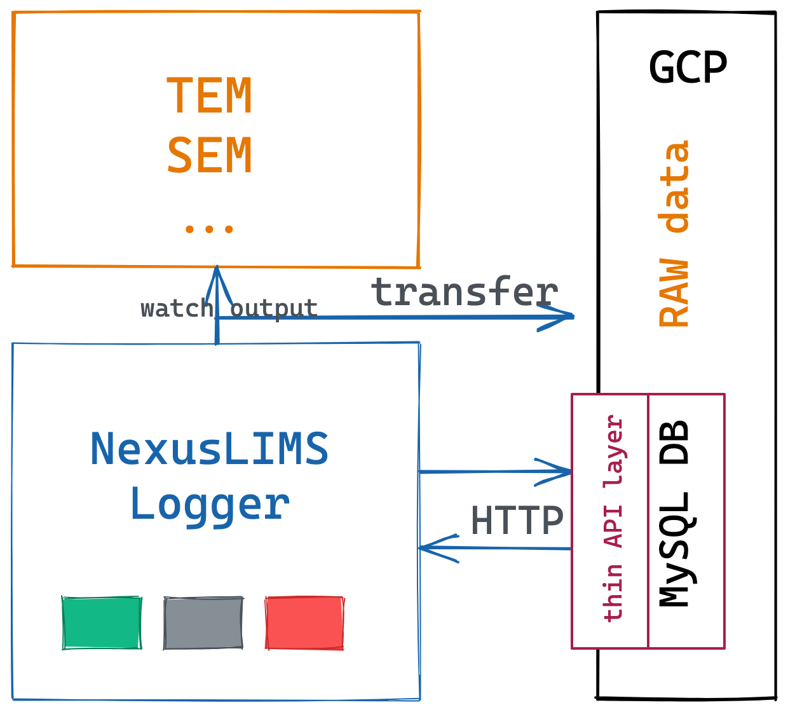

======================
NexusLIMS-Logger (GCP)
======================

**NexusLIMS-Logger** is a desktop GUI logging user's experiment session's start and end
time to define a concept of **session**. It is implemented using tkinter module of Python.
It is supposed to run on instrument control PC which has internet access.

The functionality and interface are designed to be simple and easy to use. The user's
normal instrument operation behavior is not altered except:

1. start the NexusLIMS-Logger before operating the instrument.
2. leave NexusLIMS-Logger running during the operation of the instrument.
3. click the button on the NexusLIMS-Logger to close the session after the instrument
   operation is finished.

<screenshot here..>

The cloud based version has the database deployed on the cloud, and will transfer the
raw data of the instrument to the cloud storage in the background.

Overview
========

NexusLIMS-Logger records the session information in MySQL DB, which is deployed on GCP (
Google Cloud Platform).
The communication is through a thin web app layer wrapping necessary database transactions
and exposing APIs. After the session is started, a file transfer thread starts. It watches file
changes of the instrument output folders periodically and uploaded the file to the GCP
cloud storage when there is difference detected. The difference is compared with
the MD5 checksum of the file content. The NexusLIMS-Logger should have write access
of the corresponding bucket on the cloud. When the session is closed by the user, NexusLIMS-Logger
will record the timestamp and mark the status in the database. Additionally, the file
transfer thread is stopped, and a final file transfer job is performed to ensure all
data belonging to this session is transferred to the cloud storage.

Contents
========

.. toctree::
   :maxdepth: 1

   Install & Configuration <installconfig>
   Compile to executable <distribute>
   License <license>
   Authors <authors>
   Changelog <changelog>
   Module Reference <api/modules>

Indices and tables
==================

* :ref:`genindex`
* :ref:`modindex`
* :ref:`search`

.. _toctree: http://www.sphinx-doc.org/en/master/usage/restructuredtext/directives.html
.. _reStructuredText: http://www.sphinx-doc.org/en/master/usage/restructuredtext/basics.html
.. _references: http://www.sphinx-doc.org/en/stable/markup/inline.html
.. _Python domain syntax: http://sphinx-doc.org/domains.html#the-python-domain
.. _Sphinx: http://www.sphinx-doc.org/
.. _Python: http://docs.python.org/
.. _Numpy: http://docs.scipy.org/doc/numpy
.. _SciPy: http://docs.scipy.org/doc/scipy/reference/
.. _matplotlib: https://matplotlib.org/contents.html#
.. _Pandas: http://pandas.pydata.org/pandas-docs/stable
.. _Scikit-Learn: http://scikit-learn.org/stable
.. _autodoc: http://www.sphinx-doc.org/en/stable/ext/autodoc.html
.. _Google style: https://github.com/google/styleguide/blob/gh-pages/pyguide.md#38-comments-and-docstrings
.. _NumPy style: https://numpydoc.readthedocs.io/en/latest/format.html
.. _classical style: http://www.sphinx-doc.org/en/stable/domains.html#info-field-lists
